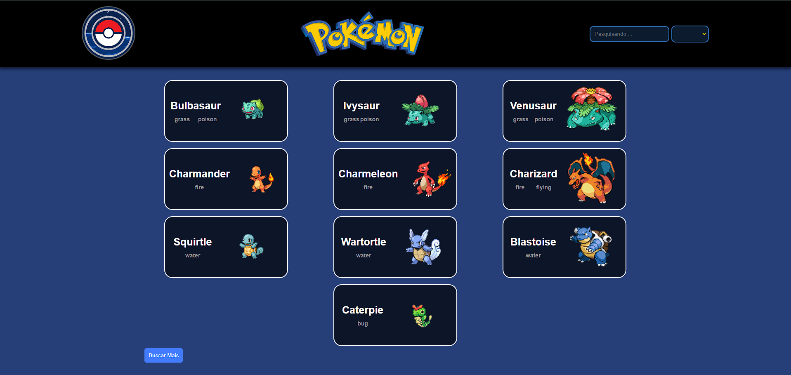

# 🚀 Quest Pokemon 
 
Este projeto é um desafio proposto pela DevQuest, uma plataforma de aprendizado de programação. O objetivo é testar nossos conhecimentos adquiridos ao longo do curso e nossa capacidade de tomar decisões técnicas.

### veja o projeto 

Clique [aqui](https://quest-react-avancado-aj77frgod-marianas-projects-c02dcf1f.vercel.app/) e veja o projeto funcionando.

## Objetivo 🎯

O objetivo deste projeto é utilizar a [pokeApi](https://pokeapi.co/) para obter informações sobre os pokemons. Aqui estão os principais requisitos:

1. **Home com Listagem de Pokemons**:
   - Criar uma página inicial (home) que exiba uma listagem de 10 pokemons iniciais.
   - Incluir um botão que, ao ser clicado, carregue mais 10 pokemons por vez.

2. **Alternância de Tema (Light / Dark)**:
   - Adicionar um botão para alternar entre os temas claro (light) e escuro (dark).

3. **Detalhes dos Pokemons**:
   - Na lista de pokemons, cada item deve exibir a imagem e o nome do pokemon.
   - Os elementos da lista devem ser clicáveis.
   - Ao clicar em um pokemon, devem ser apresentados os seguintes detalhes:
     - Imagem
     - Nome
     - Lista de movimentos
     - Lista de habilidades
     - Tipo

## Como usar 🛠️

1. **Clone o Repositório**:
   - Abra o terminal ou prompt de comando.
   - Execute o seguinte comando para clonar o repositório para a sua máquina local:
     ```
     git clone https://github.com/mariana549/Quest-React-Avancado.git
     ```
   - Isso criará uma cópia do projeto em sua máquina.

2. **Instale as Dependências**:
   - Navegue até o diretório do projeto usando o comando `cd github-user-info`.
   - Execute o seguinte comando para instalar as dependências necessárias:
     ```
     npm install ou yarn 
     ```
   - Isso instalará todas as bibliotecas e pacotes necessários para o projeto.

3. **Inicie o Servidor Local**:
   - Execute o seguinte comando para iniciar o servidor local:
     ```
     npm start ou yarn dev
     ```
   - O projeto estará disponível em `http://localhost:5173`.

4. **Explore o Projeto**:
   - Abra o navegador e acesse `http://localhost:5173` para ver o projeto funcionando.
   - Explore as diferentes páginas, interaja com os componentes e divirta-se!

## Recursos 📚

Este projeto usa os seguintes recursos:

   - **API do pokeApi**: Essa API é utilizada para obter os dados dos pokemons, como imagens, nomes, movimentos, habilidades, tipos e etc.
   - **React.js**: O React é uma biblioteca JavaScript para construção de interfaces de usuário. Ele é utilizado neste projeto para o desenvolvimento da aplicação web.
   - **Styled-components**: Essa biblioteca permite estilizar os componentes React de forma mais dinâmica e modular. Com ela, é possível criar estilos diretamente no código JavaScript.
   - **React-router-dom**: Essa biblioteca é utilizada para a navegação entre as páginas da aplicação. Ela permite criar rotas e gerenciar a transição entre diferentes telas.
   - **Context API**: A Context API é uma funcionalidade do React que permite compartilhar estados e dados entre diferentes componentes sem a necessidade de passar props manualmente. Neste projeto, ela é usada para criar o Theme Toggler, que permite alternar entre os temas claro e escuro.
   - **Axios**: O Axios é um cliente HTTP baseado em Promises que facilita a realização de requisições HTTP. Ele é utilizado aqui para pegar os dados da API do pokeApi.
   - **Responsividade**: O projeto foi desenvolvido com responsividade em mente, ou seja, ele se adapta bem a diferentes tamanhos de tela, como celulares, tablets e desktops.

#### Neste projeto, foram adicionados os seguintes recursos:

1. **Botão "Mostrar Mais Pokemons"**: Implementei o botão para mostrar mais pokemons de forma que, quando todos os cards estiverem visíveis, ele desapareça e um botão de rolagem automática para o topo apareça.

2. **Cards Transparentes durante o Carregamento**: Os cards dos pokemons são exibidos de forma meio transparente enquanto estão carregando, proporcionando uma experiência mais suave para o usuário.

3. **Efeito no Cartão do Pokemon**:
 - Adicionei uma animação para destacar o cards do Pokémon quando o usuário interagir com ele.
 - Adicionei uma funcionalidade nos cards dos pokemons que faz com que, ao passar o mouse sobre o pokemon, ele vire e mostre a parte de trás. Após um tempo, ele volta ao estado original.

4. **Pesquisa de Pokemons na Navegação**: Na barra de navegação, adicionei uma parte para pesquisar pokemons. Essa parte some quando o usuário entra no perfil de um pokemon específico.

5. **Filtrar Pokemons por Tipo**: Também na barra de navegação, incluí uma seção onde o usuário pode selecionar o tipo do pokemon desejado. Ao escolher um tipo, a lista de pokemons é filtrada de acordo.

6. **Troca Automática de Imagem para Versão Shinny**: No perfil do pokemon, adicionei uma funcionalidade que troca automaticamente a imagem do pokemon de versão normal para shinny. Essa troca é clicável, permitindo alternar manualmente entre as versões.

7. **Movimentos e habilidades**: adicionei as habilidades com o nome e descrição, e os movimentos em ordem alfabetica.


## Imagens 📷

A seguir, você pode ver algumas capturas de tela e um Gif do projeto em funcionamento:

- Imagem 1: Home.



- Gif 1: home.


- Imagem 2: perfil pokemon `Bubassauro`.


- Gif 2: perfil do `Bubassauro`


